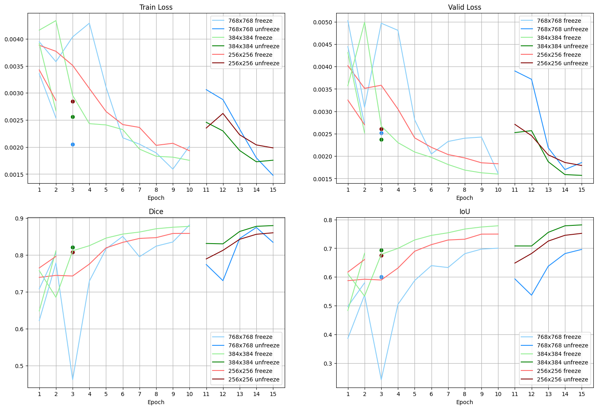

# AMLSII_assignment22_23

## Abstract
This report presents a deep learning-based ship detection model using satellite images. The model uses the U-Net architecture with a ResNet34 as the encoder and transfer learning for efficient feature extraction and segmentation. The report investigates the impact of image resolution and resource constraints on the model's performance. The cross-entropy loss, Dice coefficient and Intersection over Union (IoU) metrics are used to evaluate the model during training and validation. In contrast, the F2 Score is used to evaluate the test set. The results show that the model performs well under resource constraints, with only a 3% reduction in performance compared to the unconstrained case. Higher resolution images perform better on the test set evaluation, despite lower Dice and IoU scores during training.

## Acknownledgement
Special thanks to the Kagglers who participated in the Airbus Ship Detection Challenge [(Link)](https://www.kaggle.com/competitions/airbus-ship-detection). Their discussions in the comments section of the challenge helped me solve many problems. The code for this project is mainly referenced from Iafoss' notebook in the discussion section of the Challenge page [(Link)](https://www.kaggle.com/code/iafoss/unet34-dice-0-87). Moreover, the data pre-processing part is referenced from the inversion's notebook [(Link)](https://www.kaggle.com/code/inversion/run-length-decoding-quick-start). The models were also selected by referring to the models mentioned by the teams that gave them in the rankings. Thanks again for Kaggler's selfless contributions and active discussions in this challenge.

## Requirement
- In this report, all coding is done in Python, which uses version 3.8.12. And the following packages were used: 
    - Numpy 1.22.3
    - Matplotlib 3.5.1
    - scikit-learn 1.0.2
    - imageio 2.25
    - Fastai 2.7.11 (core package)
        - ipywidgets 8.0.5 (if using Jupyter Notebook)
    - tqdm 4.65.0
    - Pandas 1.4.1
    - torchvision 0.12.0+cu113
    - torch 1.11+cu113

## How to download dataset and some note
Open the terminal and type:
```pip install kaggle```

Once installed, type the line of code to downlaod the dataset:
```kaggle datasets download -d panlogic/ship-data -p ./ship-data```

This line of code to download the pretrained models:
```kaggle datasets download -d panlogic/pretrained-model-airbus-shipdetection -p ./Pretrained_model```

If all of them not woring, this is the [link](https://www.kaggle.com/datasets/panlogic/ship-data) for dataset and this the the [link](https://www.kaggle.com/datasets/panlogic/pretrained-model-airbus-shipdetection) for pretrained models.

Once downloaded, you can delete the 'To be download' file.

Note: PLEASE NOTE THAT some file path need to be edited mannually to fit your coding environment.

## File Demonstration
- Data Preprocessing: Reduce the amount of original dataset to a smaller amount
- image_for_report: Generate the images used in my report
- ship_detection_initial_train: The main Notebook contain the main content
- ship_detection_with_pretrained: The Notebook which is easy for checking the performence of pretrained model

## Some Results
### Learning and metric curve


### The F2 Score for different resolutoin and training type


### Some prediction

